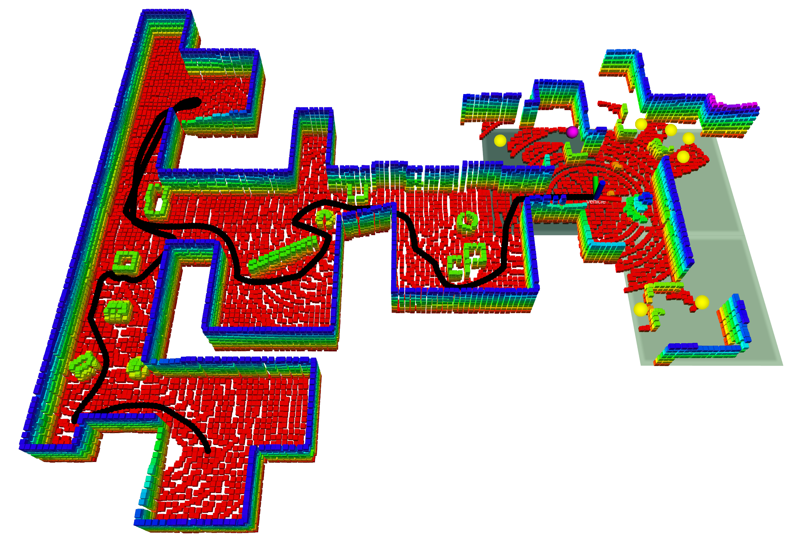
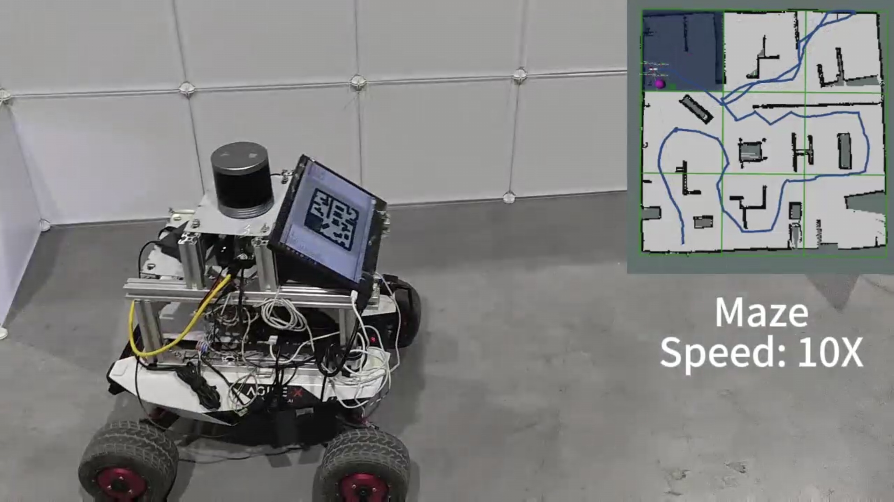
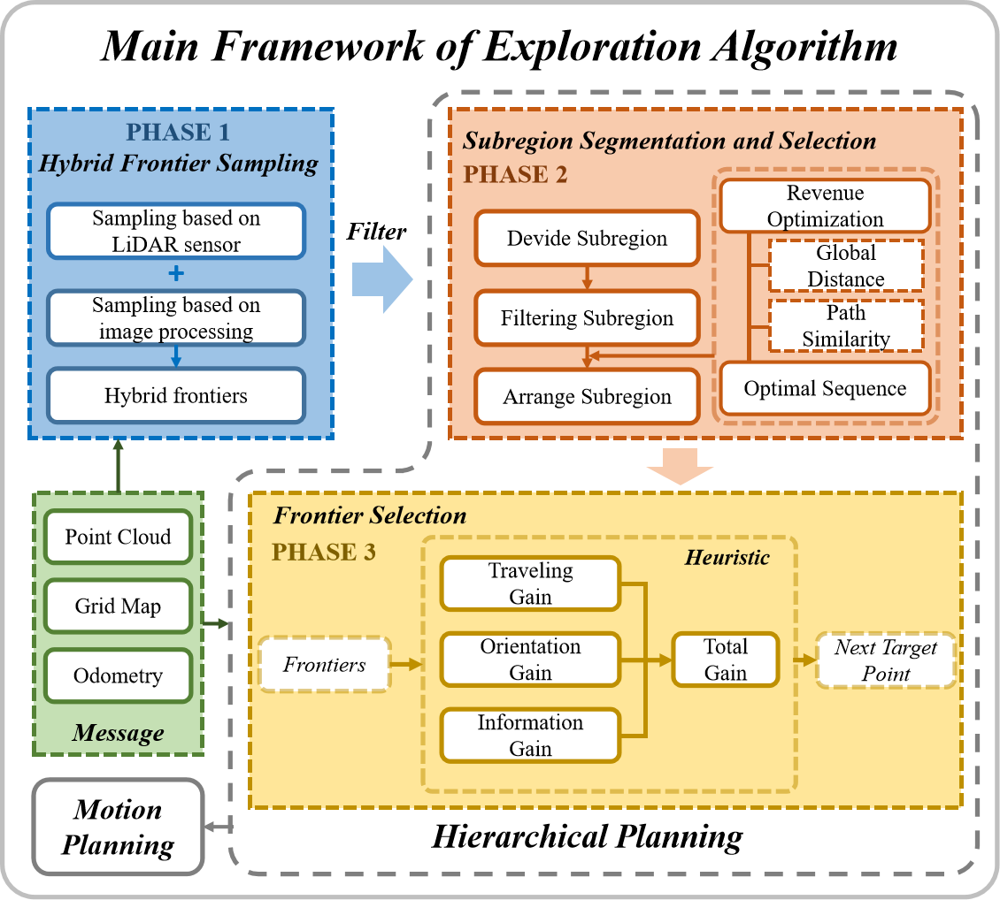

# HPHS: Hierarchical Planning based on Hybrid Frontier Sampling for Unknown Environments Exploration

## Introduction

HPHS is a system framework for rapid exploration of unknown environments. This framework is mainly composed of three modules: __Hybrid Frontier Point Sampling Module__, __Subregion Segmentation and Selection Module__ , __Frontier Selection Module__. These three modules are executed in sequence following a timeline, until the entire environment is modeled. This repository is the __Python implementation__ of our method.

<p align="center">
  
    
  
</p>

### Related Paper
HPHS: Hierarchical Planning based on Hybrid Frontier Sampling for Unknown Environments Exploration (Accepted by IEEE IROS 2024)

### Authors
Shijun Long, Ying Li, Chenming Wu, Bin Xu, and Wei Fan

### Cite
Please cite our paper if you used this project in your scientific research:

## Experiment

The method has been tested in both simulation and real-world environments, which can be seen in the [Experiment Video](https://youtu.be/MndZBmBNYSc).

## How to use

Note: This project has been tested in `Ubuntu 20.04 (ROS Noetic)`, and following dependencies are based on `ROS Noetic`. If your ROS version is not `ROS Noetic`, replace `noetic` with your ROS version name.

### 1. Basic Dependency

```bash
sudo apt-get install ros-noetic-navigation \
ros-noetic-octomap-*
```

```bash
pip3 install pyquaternion opencv-python
```
### 2. Simulation Environment

The project is run under the autonomous exploration framework provided by Robotics Institute from Carnegie Mellon University.

```bash
sudo apt update
sudo apt install libusb-dev
```

```bash
git clone https://github.com/HongbiaoZ/autonomous_exploration_development_environment.git
cd autonomous_exploration_development_environment
git checkout noetic
catkin_make
```

### 3. Install HPHS

```bash
cd ${YOUR_WORKSPACE_PATH}/src
git clone https://github.com/bit-lsj/HPHS.git
```

### 4. Run HPHS

(1) Open a new terminal and start the simulation environment:
```bash
cd autonomous_exploration_development_environment
source ./devel/setup.sh
source ~/${YOUR_WORKSPACE_PATH}/devel/setup.bash
roslaunch HPHS exploration.launch
```

(2) Open another new terminal and start exploration：
```bash
cd ${YOUR_WORKSPACE_PATH}/src/HPHS
python3 ./scripts/explorer.py 
```

### 5. Exploration In Different Environments

In launch file `./launch/cmu_framework.launch`, you can switch the different scenes:
```bash
  <arg name="world_name" default="office"/> <!--maze, indoor_1, indoor_2-->
```

## Acknowledgements

In the research process of this project, we have studied and referred to the following works:

1. [Autonomous Exploration Development Environment](https://github.com/HongbiaoZ/autonomous_exploration_development_environment.git)
2. [TDLE](https://github.com/SeanZsya/tdle.git)
3. [GDAE](https://github.com/reiniscimurs/GDAE.git)
4. [RRT Exploration](https://github.com/hasauino/rrt_exploration.git)
5. [TARE](https://github.com/caochao39/tare_planner.git)
6. [Efficient Dense Frontier Detection](https://github.com/larics/cartographer_frontier_detection.git)

We greatly appreciate the contributions of these projects.
